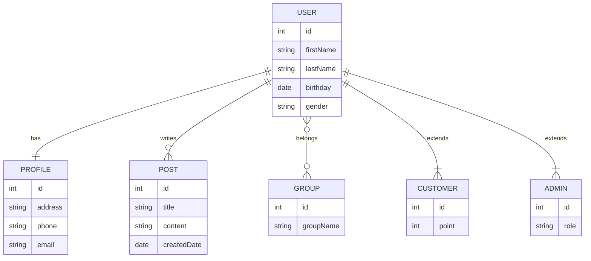

# Study

A Spring Boot application developed for learning purposes.
You can learn how to build REST APIs using Spring Boot, JPA, and Swagger through CRUD operations for Users, Profiles, Posts, Groups, Customers, and Admins.

---

## 📌 Features

- CRUD operations for: User / Profile / Post / Group / Customer / Admin
- Search API examples:
  - `/user/search/sp/women`
  - `/user/search/sp/women-children`
  - `/user/search/sp/children`
- API documentation available via Swagger UI

---

## 🛠 Tech Stack

| Technology | Version |
|------|-------------|
| Java | 21 |
| Spring Boot | 3.5.6 |
| Spring Data JPA | YES |
| Build Tool | Maven |
| DB | H2 (default) |

---

## 🚀 Hou to Run

### 1. Clone this repository
```bash
git clone <https://github.com/miyuu-aa/Study.git>
cd study
```

### 2. Start the application
```bash
mvn spring-boot:run
```
Once started, the app is accessible at: http://localhost:8080

---

## 📘 API Documentation (Swagger UI)
```bash
http://localhost:8080/swagger-ui/index.html
```

---

## 🧩 ER Diagram


---

## 📎 API Endpoints List

### User API  
| Method | Endpoint                             | Description             |
|--------|-------------------------------------|-------------------------|
| GET    | /user/{id}                           | Get a user              |
| PUT    | /user/{id}                           | Update a user           |
| DELETE | /user/{id}                           | Delete a user           |
| GET    | /user                                | Get all users           |
| POST   | /user                                | Create a user           |
| POST   | /user/{userId}/profile/{profileId}  | Link a profile          |
| POST   | /user/{userId}/post/{postId}        | Link a post             |
| POST   | /user/{userId}/group/{groupId}      | Link a group            |
| GET    | /user/search/sp/women                | Search women            |
| GET    | /user/search/sp/women-children       | Search women & children |
| GET    | /user/search/sp/children             | Search children         |

### Profile　API
| Method | Endpoint        | Description   |
|--------|----------------|---------------|
| GET    | /profile/{id}  | Get a profile |
| PUT    | /profile/{id}  | Update a profile |
| DELETE | /profile/{id}  | Delete a profile |
| GET    | /profile       | Get all profiles |
| POST   | /profile       | Create a profile |

### Post API
| Method | Endpoint     | Description |
|--------|-------------|-------------|
| GET    | /post/{id}  | Get a post  |
| PUT    | /post/{id}  | Update a post |
| DELETE | /post/{id}  | Delete a post |
| GET    | /post       | Get all posts |
| POST   | /post       | Create a post |


### Group API
| Method | Endpoint     | Description |
|--------|-------------|-------------|
| GET    | /group/{id} | Get a group |
| PUT    | /group/{id} | Update a group |
| DELETE | /group/{id} | Delete a group |
| GET    | /group      | Get all groups |
| POST   | /group      | Create a group |

### Customer API
| Method | Endpoint               | Description          |
|--------|-----------------------|--------------------|
| GET    | /customer/{id}         | Get a customer     |
| PUT    | /customer/{id}         | Update a customer  |
| DELETE | /customer/{id}         | Delete a customer  |
| PUT    | /customer/{id}/point   | Update points      |
| PUT    | /customer/{id}/all     | Update all fields  |
| POST   | /customer/{id}/all     | Create with all fields |
| GET    | /customer              | Get all customers  |
| POST   | /customer              | Create a customer  |

### Admin API
| Method | Endpoint           | Description         |
|--------|------------------|-------------------|
| GET    | /admin/{id}       | Get an admin      |
| PUT    | /admin/{id}       | Update an admin   |
| DELETE | /admin/{id}       | Delete an admin   |
| PUT    | /admin/{id}/role  | Update role       |
| PUT    | /admin/{id}/all   | Update all fields |
| POST   | /admin/{id}/all   | Create all fields |
| GET    | /admin            | Get all admins    |
| POST   | /admin            | Create an admin   |

---

## 📝 Notes
- This project is for study and self-learning.
- Specifications may change frequently.
- Security settings are simplified.

---

## ✍️ Auther
Miyu Aoki
